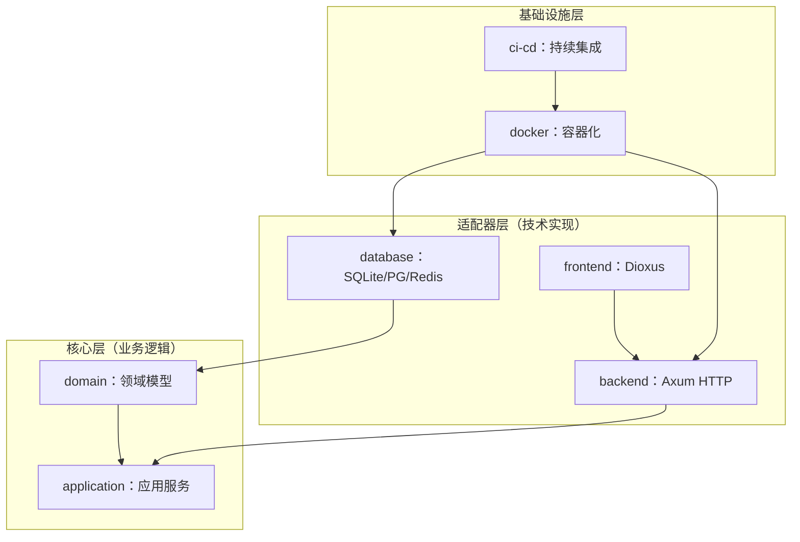
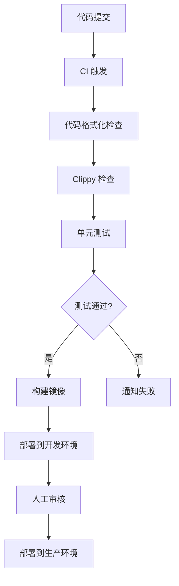

# Rust 全栈项目架构整合方案

# Rust 全栈项目架构整合方案

**版本**: v1.0   **日期**: 2026-05-20   **适用技术栈**: Axum + Dioxus + SQLite + PostgreSQL + Redis

---

## 一、方案概述

本方案整合了**六边形架构思想**、**技术栈分层组织**和**完整工程化配置**，旨在为 Rust 全栈项目提供一个既符合架构规范又具备工程实用性的开发框架。

### 核心原则

| 原则 | 说明 |
| --- | --- |
| **依赖倒置** | 所有依赖指向领域层，确保业务逻辑独立于技术实现 |
| **关注点分离** | 领域层、应用层、适配器层职责清晰 |
| **技术栈内聚** | 按技术栈组织代码，便于团队分工 |
| **工程化完整** | 预置 Docker、CI/CD、代码规范等基础设施 |

---

## 二、架构设计

### 2.1 架构层次图



### 2.2 分层职责说明

| 层级 | 职责 | 包含内容 |
| --- | --- | --- |
| **domain** | 核心业务模型 | 聚合根、值对象、领域服务、出站端口 |
| **application** | 应用服务编排 | 用例、DTO、入站端口实现 |
| **backend** | HTTP 接口层 | 路由、控制器、中间件、依赖注入 |
| **database** | 数据持久化 | 仓储实现、连接池、缓存 |
| **frontend** | 用户界面层 | 组件、页面、状态管理、API 调用 |
| **common** | 通用工具 | 类型定义、工具函数、宏 |

---

## 三、项目目录结构

```plaintext
myapp/
├── Cargo.toml                          # Workspace 根配置
├── .cargo/
│   └── config.toml                     # Rust 编译配置
├── .env.example                        # 环境变量示例
├── .rustfmt.toml                       # 代码格式化规则
├── .clippy.toml                        # Clippy lint 规则
├── Makefile                            # 工程化命令封装
├── docker/
│   ├── Dockerfile
│   ├── docker-compose.yml              # 开发环境配置
│   └── docker-compose.prod.yml         # 生产环境配置
├── migrations/                         # SQLx 数据库迁移脚本
│   └── .keep
├── .github/workflows/
│   ├── ci.yml                          # 持续集成流程
│   └── cd.yml                          # 持续部署流程
└── crates/
    ├── domain/                         # 领域层（纯业务模型）
    │   ├── Cargo.toml
    │   ├── src/
    │   │   ├── lib.rs
    │   │   ├── aggregate/              # 聚合根（User、Order...）
    │   │   ├── value_object/           # 值对象（Email、Money...）
    │   │   ├── service/                # 领域服务
    │   │   ├── event/                  # 领域事件
    │   │   ├── port/                   # 出站端口（Repository Trait）
    │   │   └── error/                  # 领域错误枚举
    │   └── tests/                      # 领域层单元测试
    ├── application/                    # 应用层（用例编排）
    │   ├── Cargo.toml
    │   ├── src/
    │   │   ├── lib.rs
    │   │   ├── service/                # 应用服务（实现 UseCase）
    │   │   ├── dto/                    # 请求/响应 DTO
    │   │   ├── port/                   # 入站端口（UseCase Trait）
    │   │   └── error/                  # 应用错误枚举
    │   └── tests/                      # 应用层测试（含 Mock）
    ├── backend/                        # Axum 后端适配器
    │   ├── Cargo.toml
    │   └── src/
    │       ├── main.rs                 # 应用入口
    │       ├── api/                    # REST API 实现
    │       │   ├── routes.rs           # 路由定义
    │       │   └── handlers.rs         # 请求处理器
    │       ├── middleware/             # 中间件（鉴权、日志等）
    │       └── di.rs                   # 依赖注入配置
    ├── database/                       # 数据库适配器
    │   ├── Cargo.toml
    │   └── src/
    │       ├── lib.rs
    │       ├── sqlite/                 # SQLite 仓储实现
    │       ├── postgres/               # PostgreSQL 仓储实现
    │       └── redis/                  # Redis 缓存实现
    ├── frontend/                       # Dioxus 前端适配器
    │   ├── Cargo.toml
    │   └── src/
    │       ├── main.rs                 # Dioxus 入口
    │       ├── components/             # UI 组件
    │       ├── pages/                  # 页面结构
    │       ├── state/                  # 状态管理
    │       └── api/                    # API 客户端封装
    └── common/                         # 通用工具库
        ├── Cargo.toml
        └── src/
            ├── lib.rs
            ├── types/                  # 通用类型（ID、时间等）
            ├── utils/                  # 工具函数
            └── macros/                 # 宏定义

```
---

## 四、核心组件说明

### 4.1 领域层（domain）

**核心职责**：定义业务领域的核心概念和规则。

```rust
// domain/src/aggregate/user.rs
use crate::value_object::Email;
use crate::error::DomainError;

#[derive(Debug, Clone)]
pub struct User {
    id: UserId,
    name: String,
    email: Email,
}

impl User {
    pub fn new(id: UserId, name: String, email: Email) -> Result<Self, DomainError> {
        // 业务规则校验
        if name.is_empty() {
            return Err(DomainError::InvalidName);
        }
        Ok(Self { id, name, email })
    }
}

```

### 4.2 应用层（application）

**核心职责**：编排领域服务，实现业务用例。

```rust
// application/src/service/user_service.rs
use crate::dto::CreateUserRequest;
use crate::port::UserRepository;
use domain::aggregate::User;

pub struct UserApplicationService {
    repo: Box<dyn UserRepository>,
}

impl UserApplicationService {
    pub async fn create_user(&self, req: CreateUserRequest) -> Result<User, ApplicationError> {
        let user = User::new(
            UserId::generate(),
            req.name,
            Email::new(req.email)?
        )?;
        self.repo.save(&user).await?;
        Ok(user)
    }
}

```

### 4.3 后端适配器（backend）

**核心职责**：处理 HTTP 请求，调用应用服务。

```rust
// backend/src/api/handlers.rs
use axum::{extract::Json, http::StatusCode};
use application::service::UserApplicationService;

pub async fn create_user(
    Json(req): Json<CreateUserRequest>,
    State(service): State<UserApplicationService>,
) -> Result<Json<User>, StatusCode> {
    let user = service.create_user(req).await.map_err(|_| StatusCode::INTERNAL_SERVER_ERROR)?;
    Ok(Json(user))
}

```

### 4.4 数据库适配器（database）

**核心职责**：实现仓储端口，提供数据持久化能力。

```rust
// database/src/sqlite/user_repo.rs
use domain::port::UserRepository;
use sqlx::SqlitePool;

pub struct SqliteUserRepository {
    pool: SqlitePool,
}

impl UserRepository for SqliteUserRepository {
    async fn save(&self, user: &User) -> Result<(), RepositoryError> {
        sqlx::query!(
            "INSERT INTO users (id, name, email) VALUES (?, ?, ?)",
            user.id().to_string(),
            user.name(),
            user.email().as_str()
        )
        .execute(&self.pool)
        .await?;
        Ok(())
    }
}

```
---

## 五、依赖关系

### 5.1 Crate 依赖矩阵

| Crate | 依赖项 | 被依赖项 |
| --- | --- | --- |
| domain | \- | application, database |
| application | domain, common | backend |
| backend | application, database, common | \- |
| database | domain, common | backend |
| frontend | common | \- |
| common | \- | domain, application, backend, frontend |

### 5.2 Cargo.toml 示例

```toml
[workspace]
members = [
    "crates/domain",
    "crates/application",
    "crates/backend",
    "crates/database",
    "crates/frontend",
    "crates/common",
]

[workspace.package]
edition = "2024"
version = "0.1.0"

[profile.release]
opt-level = 3

```
---

## 六、开发流程

### 6.1 新增业务模块流程


### 6.2 具体步骤说明

| 步骤 | 操作位置 | 说明 |
| --- | --- | --- |
| 1 | `domain/src/aggregate/` | 添加聚合根和值对象 |
| 2 | `domain/src/port/` | 定义仓储接口（Trait） |
| 3 | `application/src/service/` | 实现应用服务（UseCase） |
| 4 | `application/src/dto/` | 定义请求/响应 DTO |
| 5 | `database/src/{sqlite/postgres}/` | 实现仓储接口 |
| 6 | `backend/src/api/handlers.rs` | 创建 HTTP 处理器 |
| 7 | `backend/src/api/routes.rs` | 注册路由 |
| 8 | `backend/src/di.rs` | 添加依赖注入配置 |

---

## 七、工程化配置

### 7.1 Makefile 命令

| 命令 | 功能 |
| --- | --- |
| `make dev` | 启动开发环境（Docker + 热重载） |
| `make build` | 构建生产版本 |
| `make test` | 运行全量测试 |
| `make lint` | 运行 Clippy 检查 |
| `make fmt` | 格式化代码 |
| `make migrate` | 运行数据库迁移 |

### 7.2 Docker 服务

```yaml
# docker-compose.yml
services:
  postgres:
    image: postgres:18-alpine-slim
    environment:
      POSTGRES_USER: app
      POSTGRES_PASSWORD: secret
      POSTGRES_DB: app_db
    ports:
      - "5432:5432"

  redis:
    image: redis:8-alpine-slim
    ports:
      - "6379:6379"

```

### 7.3 CI/CD 流程


---

## 八、技术选型说明

| 分类 | 技术 | 选型理由 |
| --- | --- | --- |
| HTTP 框架 | Axum | 高性能、无宏API、与 Tower 生态无缝集成 |
| 前端框架 | Dioxus | Rust 原生、Web/Desktop 跨平台、响应式状态管理 |
| 主数据库 | PostgreSQL | 功能完备、生态成熟、适合复杂业务 |
| 轻量存储 | SQLite | 开发测试便捷、文件式存储、零配置 |
| 缓存 | Redis | 高性能、支持多种数据结构、成熟稳定 |
| ORM | SQLx | 类型安全、编译期检查、支持多种数据库 |
| 日志 | Tracing | 结构化日志、支持分布式追踪 |
| 依赖注入 | 手动构造 | Rust 类型系统天然支持、无额外依赖 |

---

## 九、架构优势总结

| 优势 | 说明 |
| --- | --- |
| **领域纯净** | domain crate 不依赖任何外部库，可独立测试 |
| **依赖倒置** | 技术实现依赖业务接口，而非相反 |
| **技术栈内聚** | 按技术栈组织代码，团队分工清晰 |
| **可测试性** | 各层可独立测试，支持 Mock |
| **工程化完整** | 预置 Docker、CI/CD、代码规范 |
| **扩展性强** | 新增业务只需添加代码，无需修改底座 |

---

## 十、版本历史

| 版本 | 日期 | 变更说明 |
| --- | --- | --- |
| v1.0 | 2026-05-20 | 初始版本，整合六边形架构 + 技术栈分层 |

---

**文档说明**：本方案适用于固定技术栈的 Rust 全栈项目，兼顾架构规范与工程实用性，适合作为个人知识库长期保存。
